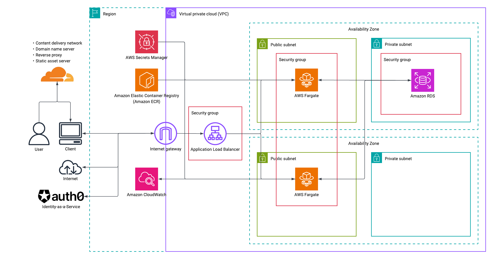

#  Canary crystallises chaos into charts
[Canary](https://canary.markets) is an agentic analyst who uncovers business stories hidden in data. You can interact with it just like how you would prepare a report or write scripts on a Jupyter Notebook.

## Inspiration
- [the Economist](https://www.economist.com/)
- [the Acquired podcast](https://www.acquired.fm/)
- [Bloomberg terminal](https://professional.bloomberg.com/products/bloomberg-terminal/)
- [Factset workstation](https://www.factset.com/)

## Architecture

[Architecture diagram on Lucidchart](https://lucid.app/lucidchart/c42a4a91-df21-4cbd-8531-80d03def2023/edit?viewport_loc=-2084%2C-780%2C3105%2C1505%2C0_0&invitationId=inv_acd69b55-1da8-4e08-a279-c3a66c4b2fc0)

Check out [the project wiki](https://github.com/szeyoong-low/canary/wiki) for deep dives on my design process.

### Tech stack 
| Layer | Choice |
|---|---|
| Frontend | React (Compiler), TypeScript, Vite, React Router, Apache ECharts, Tailwind CSS, Base UI |
| Backend | FastAPI, Python 3.12, httpx, Pydantic |
| Data sources | Financial Modelling Prep |
| Data pipeline | Polars |
| Database | PostgreSQL, SQLAlchemy, asyncpg, Alembic, dbeaver |
| AI agent | LangGraph, OpenRouter |
| Deployment | AWS, Cloudflare Workers, Terraform, Docker |
| DevOps | Git, GitHub Actions, npm, uv, Ruff, ESLint, Prettier, Lefthook |
| Testing | pytest asyncio, unittest mock, Postman |
| Coding agent | Claude Code (Skills, MCP) |
| Design & diagramming | Figma, Mermaid, Lucidchart |